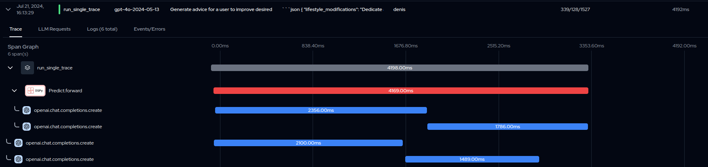

# Example for Langtrace tracking with DSPy
* [Optional] Install [pyenv](https://github.com/pyenv/pyenv)
* Install [PDM](https://pdm-project.org/en/latest/)
* Run `pdm install`
* Copy `.env.example` to `.env` and fill in the values
* Run `pdm run python -m main_1.py`
  * Issues:
    * spans are only grouped under group span if the DSPy cache is cleared
    * otherwise there is no root span shown
    * even if the caches are cleared, there are some calls shown outside of root span
    * 

* To clean DSPy cache, run `make dspy-clear-cache`
