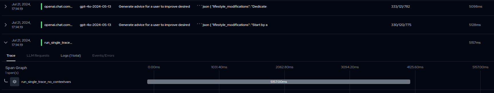
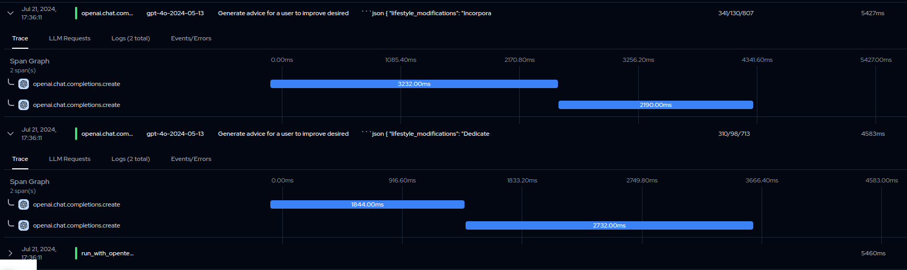

# Example for Langtrace tracking with DSPy
* [Optional] Install [pyenv](https://github.com/pyenv/pyenv)
* Install [PDM](https://pdm-project.org/en/latest/)
* Run `pdm install`
* Copy `.env.example` to `.env` and fill in the values
* Run `pdm run python -m main.py`
  * Issues: if we provide contextpars when starting a thread
    * spans are only grouped under group span if the DSPy cache is cleared
    * otherwise there is no root span shown
    * even if the caches are cleared, there are some calls shown outside of root span
    * 
  * Issues 2: if no contextvars are provided 
    * 
  * Issues 3: If we provide `current_context` via opentelemetry as in Langtrace example
    * Calls are still not grouped under a single span
    * Token counts on fresh runs are missing, overall token count missing
    * Individual spans are not given a meaningful name
    * 

* To clean DSPy cache, run `make dspy-clear-cache`
